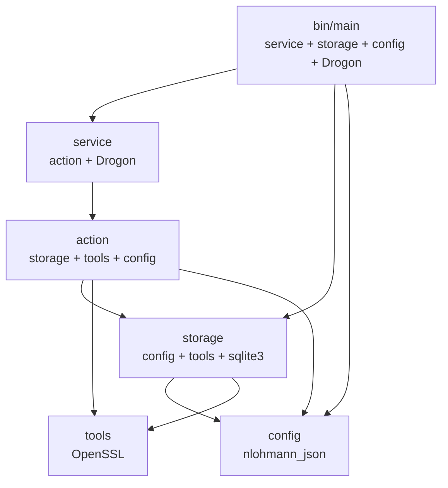

# CMake 多层级重构计划

## 1. 当前问题分析

当前项目使用 **单 `CMakeLists.txt`** 文件，存在以下问题：

| 问题 | 影响 |
|------|------|
| `file(GLOB_RECURSE)` 收集源文件 | 添加/删除 `.cc` 文件不会自动触发 CMake 重新配置 |
| 全部源文件打成一个 `add_executable` | 改动任何一个 `.cc` 都会触发全量重链接 |
| 无法独立测试单个模块 | 测试必须链接整个可执行文件的所有依赖 |
| 没有库目标隔离 | 无法实现模块级别的增量编译 |

## 2. 模块依赖分析

通过分析头文件的 `#include` 关系，得出以下依赖图：



### 详细依赖表

| 模块 | 内部依赖 | 外部依赖 |
|------|---------|---------|
| `tools` | 无 | `OpenSSL::Crypto` |
| `config` | 无 | `nlohmann_json::nlohmann_json` |
| `storage` | `update_tools`, `update_config` | `sqlite3`, `nlohmann_json::nlohmann_json` |
| `action` | `update_storage`, `update_tools`, `update_config` | `nlohmann_json::nlohmann_json` |
| `service` | `update_action` (传递: storage, tools, config) | `Drogon::Drogon`, `nlohmann_json::nlohmann_json` |
| `bin` | `update_service`, `update_storage`, `update_config` | `Drogon::Drogon`, `spdlog::spdlog`, `OpenSSL::Crypto` |

## 3. 目标文件结构

```
updata_server/
├── CMakeLists.txt                 ← 重写: 只做 find_package + add_subdirectory
├── src/
│   ├── CMakeLists.txt             ← 新建: 按依赖顺序 add_subdirectory
│   ├── tools/
│   │   └── CMakeLists.txt         ← 新建: add_library(update_tools STATIC ...)
│   ├── config/
│   │   └── CMakeLists.txt         ← 新建: add_library(update_config STATIC ...)
│   ├── storage/
│   │   └── CMakeLists.txt         ← 新建: add_library(update_storage STATIC ...)
│   ├── action/
│   │   └── CMakeLists.txt         ← 新建: add_library(update_action STATIC ...)
│   ├── service/
│   │   └── CMakeLists.txt         ← 新建: add_library(update_service STATIC ...)
│   └── bin/
│       └── CMakeLists.txt         ← 新建: add_executable(software_update_platform ...)
├── include/                       ← 不变
├── config/                        ← 不变 (运行时配置)
├── tests/                         ← 未来添加测试
├── migrations/                    ← 不变
├── docs/                          ← 不变
├── python/                        ← 不变
└── web/                           ← 不变
```

## 4. 各文件完整内容

### 4.1 根目录 `CMakeLists.txt`

```cmake
cmake_minimum_required(VERSION 3.20)

project(software_update_platform VERSION 0.1.0 LANGUAGES CXX)

set(CMAKE_CXX_STANDARD 20)
set(CMAKE_CXX_STANDARD_REQUIRED ON)
set(CMAKE_CXX_EXTENSIONS OFF)

option(UPDATE_PLATFORM_BUILD_WEB "Build web assets with external Node tooling" OFF)

# ── 全局外部依赖 ──
find_package(Drogon CONFIG REQUIRED)
find_package(spdlog CONFIG REQUIRED)
find_package(nlohmann_json CONFIG REQUIRED)
find_package(OpenSSL REQUIRED)

# ── 源码子目录 ──
add_subdirectory(src)
```

### 4.2 `src/CMakeLists.txt`

```cmake
# 按依赖顺序声明，先声明底层模块
add_subdirectory(tools)
add_subdirectory(config)
add_subdirectory(storage)
add_subdirectory(action)
add_subdirectory(service)
add_subdirectory(bin)
```

### 4.3 `src/tools/CMakeLists.txt`

```cmake
add_library(update_tools STATIC
    canupgrade.cc
    md5.cc
    sha256.cc
    TimestampString.cc
)

target_include_directories(update_tools
    PUBLIC
        ${PROJECT_SOURCE_DIR}/include
)

target_link_libraries(update_tools
    PRIVATE
        OpenSSL::Crypto
)
```

**说明**: `tools.h` 中 `#include <openssl/evp.h>` 仅在 `.cc` 实现中使用（MD5/SHA256 计算），不在头文件内联函数中使用，所以 `OpenSSL::Crypto` 用 `PRIVATE` 即可。

### 4.4 `src/config/CMakeLists.txt`

```cmake
add_library(update_config STATIC
    app_config.cc
)

target_include_directories(update_config
    PUBLIC
        ${PROJECT_SOURCE_DIR}/include
)

target_link_libraries(update_config
    PRIVATE
        nlohmann_json::nlohmann_json
)
```

**说明**: `app_config.h` 的 `#include <nlohmann/json.hpp>` 出现在头文件中，但 json 是 header-only，链接时不需要，所以这里 `PRIVATE` 即可。

### 4.5 `src/storage/CMakeLists.txt`

```cmake
add_library(update_storage STATIC
    storage.cc
    addTask.cc
    getALLPackages.cc
    getALLProducts.cc
    getALLReleases.cc
    getConvertRule.cc
    getDocument.cc
    getFutureDirections.cc
    getLatestRelease.cc
    getRecentUpdates.cc
    getRecommendations.cc
    getSiteProfile.cc
    getTask.cc
    updateTask.cc
)

target_include_directories(update_storage
    PUBLIC
        ${PROJECT_SOURCE_DIR}/include
)

target_link_libraries(update_storage
    PUBLIC
        update_config
    PRIVATE
        update_tools
        sqlite3
        nlohmann_json::nlohmann_json
)
```

**说明**: 
- `storage.h` 包含 `#include <config/app_config.h>`，所以 `update_config` 用 `PUBLIC`（让依赖 storage 的上层模块也能访问 config 头文件）
- `update_tools` 被 storage 的 `.cc` 文件内部使用（如 MD5/SHA256），不在 `storage.h` 头文件中出现，所以用 `PRIVATE`
- `sqlite3` 和 `nlohmann_json` 仅在 `.cc` 中使用，用 `PRIVATE`

### 4.6 `src/action/CMakeLists.txt`

```cmake
add_library(update_action STATIC
    CheckUpdataAction/checkupdate.cc
    ConvertDataTaskAction/createTask.cc
    ConvertDataTaskAction/getTaskResult.cc
    ConvertDataTaskAction/getTaskStatus.cc
    ConvertDataTaskAction/runt_task.cc
    DocumentAction/getDocumnet.cc
    DocumentAction/getReleases.cc
    ProductsAction/GetFutureDirections.cc
    ProductsAction/GetPortfolioHome.cc
    ProductsAction/GetRecentUpdates.cc
    ProductsAction/GetRecommendations.cc
    ProductsAction/Getrecommendation.cc
    ProductsAction/GetSiteProfile.cc
    ProductsAction/ListProducts.cc
)

target_include_directories(update_action
    PUBLIC
        ${PROJECT_SOURCE_DIR}/include
)

target_link_libraries(update_action
    PUBLIC
        update_storage
    PRIVATE
        update_tools
        update_config
        nlohmann_json::nlohmann_json
)
```

**说明**:
- `update_storage` 用 `PUBLIC`，因为 action 的多个头文件包含 `storage.h`，上层 service 需要间接访问 storage
- `update_tools` 用 `PRIVATE`，虽然 `CheckUpdateAction.h` 包含了 `tools.h`，但 service 层不需要直接使用 tools
- `update_config` 用 `PRIVATE`，仅 `ConvertDataTaskAction` 内部使用

### 4.7 `src/service/CMakeLists.txt`

```cmake
add_library(update_service STATIC
    ApiRoutes.cc
    register_check_update_routes.cc
    register_convert_task_result_routes.cc
    register_convert_task_routes.cc
    register_convert_task_status_routes.cc
    register_document_routes.cc
    register_portfolio_home_routes.cc
    register_portfolioHome_routes.cc
    register_products_routes.cc
    register_release_routes.cc
)

target_include_directories(update_service
    PUBLIC
        ${PROJECT_SOURCE_DIR}/include
)

target_link_libraries(update_service
    PUBLIC
        update_action
    PRIVATE
        Drogon::Drogon
        nlohmann_json::nlohmann_json
)
```

**说明**: `ApiRoutes.h` 直接 include 了所有 action 头文件，所以 `update_action` 用 `PUBLIC`。

### 4.8 `src/bin/CMakeLists.txt`

```cmake
add_executable(software_update_platform
    main.cpp
)

target_link_libraries(software_update_platform
    PRIVATE
        update_service
        update_storage
        update_config
        Drogon::Drogon
        spdlog::spdlog
        OpenSSL::Crypto
)
```

**说明**:
- `update_service` 会通过 `PUBLIC` 传递带出 `update_action` → `update_storage` → `update_config` 全链
- 单独列出 `update_storage` 和 `update_config` 是因为 `main.cpp` 直接 include 了它们的头文件
- `Drogon::Drogon`、`spdlog::spdlog` 是 main.cpp 中直接使用的
- 无需 `target_include_directories`，因为所有库都通过 `PUBLIC` 传递了 include 路径

## 5. 执行步骤

1. **备份当前构建**: 删除 `build/` 目录（`rm -rf build/`）
2. **创建 7 个新 CMakeLists.txt 文件**（内容见上文）
3. **重写根 `CMakeLists.txt`**（内容见上文）
4. **重新配置并构建**:
   ```bash
   mkdir build && cd build
   cmake ..
   make -j$(nproc)
   ```
5. **验证可执行文件正常运行**

## 6. 注意事项

- **源文件列表是显式的**: 添加新 `.cc` 文件时必须手动在对应 `CMakeLists.txt` 中添加，这比 `GLOB_RECURSE` 更安全
- **`.gitignore` 应包含 `build/`**: 确保构建产物不被提交
- **所有 target 名带 `update_` 前缀**: 避免与系统库或第三方库命名冲突（如 `tools` 太通用）
- **未来添加测试**: 可以在 `tests/` 目录下创建独立 CMakeLists.txt，只链接需要测试的库（如只链接 `update_storage` 而不需要 `Drogon`）
