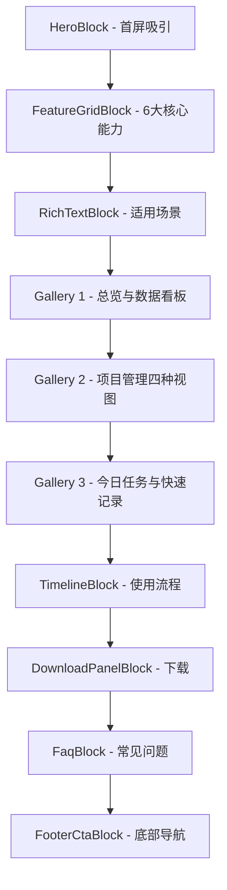

# Daily 插件介绍页重设计方案

> **目标**：重新设计 `data/releases/Daily/v1.0.0/vue/` 下的 `page.json` 和 `DailyReleasePage.vue`，使介绍页内容丰富、结构清晰、视觉美观。

---

## 一、当前问题分析

### 内容问题

| 问题 | 说明 |
|------|------|
| 功能描述过于笼统 | 仅 3 条泛泛描述，未体现插件 4 大模块的具体能力 |
| 截图堆砌 | 10 张截图平铺在一个 gallery，无分组无层次 |
| 遗漏截图 | `今日任务.png` 存在但未被引用 |
| 缺少功能亮点 | 总览页的 5 种图表、项目 4 种视图、快速记录 4 个 tab 未展开说明 |

### 视觉问题（DailyReleasePage.vue）

| 问题 | 说明 |
|------|------|
| 未使用设计 token | 硬编码颜色值、字号、间距，与 web 设计系统脱节 |
| 无交互反馈 | 卡片无 hover 效果，图片无缩放，视觉静态 |
| 层次感不足 | 所有 article 外观相同，无主次区分 |
| 响应式粗糙 | 仅 auto-fit 网格，无针对性移动端适配 |

---

## 二、页面结构重设计

整体叙事逻辑：**吸引 → 了解 → 细看 → 行动**



### Block 1 — HeroBlock（首屏）

保持 HeroBlock，优化文案，让主图展示总览页全貌。

```json
{
  "type": "HeroBlock",
  "props": {
    "eyebrow": "Obsidian Plugin",
    "title": "Daily",
    "subtitle": "任务管理 · 项目规划 · 进度复盘 —— 在 Obsidian 里打通每一天的工作流。支持表格、看板、甘特图、思维导图四种项目视图，配合热力图和趋势图复盘每日进展。",
    "primaryText": "下载 v1.0.0",
    "primaryHref": "/data/packages/Daily/v1.0.0/Daily-v1.0.0.zip",
    "secondaryText": "查看功能详情",
    "secondaryHref": "#features",
    "image": "/data/releases/Daily/v1.0.0/vue/总览.png"
  }
}
```

**改动点**：
- `subtitle` 更完整地描述插件能力
- 新增 `secondaryText` 作为页内锚点导航

### Block 2 — FeatureGridBlock（核心能力）

从 3 个扩展为 6 个，覆盖所有模块的核心功能：

```json
{
  "type": "FeatureGridBlock",
  "props": {
    "items": [
      {
        "title": "📋 任务总览",
        "desc": "今日任务、时间线、30天完成趋势、周任务图、年度热力图 —— 五种维度全面掌握任务节奏。"
      },
      {
        "title": "📊 项目进度",
        "desc": "创建项目、管理任务、导出数据。支持项目导入，一站式管理所有项目。"
      },
      {
        "title": "🎯 今日任务",
        "desc": "专注当天：展示今日待办、已完成、未完成，实时进度百分比一目了然。"
      },
      {
        "title": "✏️ 快速记录",
        "desc": "写日记、追加笔记、创建任务、导图补充 —— 四种记录方式覆盖不同场景。"
      },
      {
        "title": "🔄 多视图切换",
        "desc": "同一项目可在表格、看板、甘特图和思维导图之间自由切换，从计划到执行持续推进。"
      },
      {
        "title": "📈 数据复盘",
        "desc": "热力图展示全年活跃度，趋势图呈现30天完成节奏，让进步可量化、可回顾。"
      }
    ]
  }
}
```

### Block 3 — RichTextBlock（适用场景）

```json
{
  "type": "RichTextBlock",
  "props": {
    "title": "适合谁使用",
    "content": "Daily 面向在 Obsidian 中管理个人项目和每日任务的人。无论备考复习、写作计划还是日常习惯追踪，它都能把零散的记录沉淀为可追踪的任务与项目视图。四种记录方式减少在日记、任务列表、项目计划之间来回切换的成本；多视图让同一批数据从不同角度被理解；热力图和趋势图让每日进步清晰可见。"
  }
}
```

### Block 4 — ScreenshotGalleryBlock（总览与数据看板）

将总览相关截图归类展示：

```json
{
  "type": "ScreenshotGalleryBlock",
  "props": {
    "title": "总览与数据看板",
    "intro": "总览页面提供两种视角：任务总览展示今日任务和各项趋势图；项目进度集中管理所有项目的创建与跟踪。",
    "items": [
      {
        "title": "总览页面",
        "desc": "任务总览和项目进度两个 Tab，一屏掌握全局。",
        "image": "/data/releases/Daily/v1.0.0/vue/总览.png"
      },
      {
        "title": "年度热力图",
        "desc": "类似 GitHub 贡献图的年度活跃热力图，直观展示持续节奏。",
        "image": "/data/releases/Daily/v1.0.0/vue/项目总览-热力图.png"
      },
      {
        "title": "项目进度页",
        "desc": "集中查看和管理所有项目的整体进度。",
        "image": "/data/releases/Daily/v1.0.0/vue/项目进度页.png"
      }
    ]
  }
}
```

### Block 5 — ScreenshotGalleryBlock（项目管理四种视图）

```json
{
  "type": "ScreenshotGalleryBlock",
  "props": {
    "title": "项目管理 · 四种视图",
    "intro": "每个项目都可以在表格、看板、甘特图和思维导图之间切换，适合从规划到执行持续推进。",
    "items": [
      {
        "title": "表格视图",
        "desc": "结构化查看所有任务属性和状态。",
        "image": "/data/releases/Daily/v1.0.0/vue/项目-表格.png"
      },
      {
        "title": "看板视图",
        "desc": "用阶段列管理任务流转状态。",
        "image": "/data/releases/Daily/v1.0.0/vue/项目-看板.png"
      },
      {
        "title": "甘特图视图",
        "desc": "时间线视角理解项目节奏和交付窗口。",
        "image": "/data/releases/Daily/v1.0.0/vue/项目-甘特图.png"
      },
      {
        "title": "思维导图视图",
        "desc": "用导图拆解项目目标、路径和依赖关系。",
        "image": "/data/releases/Daily/v1.0.0/vue/项目-思维导图.png"
      }
    ]
  }
}
```

### Block 6 — ScreenshotGalleryBlock（今日任务与快速记录）

新增引用 `今日任务.png`：

```json
{
  "type": "ScreenshotGalleryBlock",
  "props": {
    "title": "今日任务 · 快速记录",
    "intro": "今日任务页专注当天待办与完成情况；快速记录提供写日记、追加笔记、创建任务和导图补充四种方式。",
    "items": [
      {
        "title": "今日任务",
        "desc": "展示今日待办、已完成、未完成和进度百分比。",
        "image": "/data/releases/Daily/v1.0.0/vue/今日任务.png"
      },
      {
        "title": "快速记录 - 创建任务",
        "desc": "快速创建当天任务或项目记录，支持项目数据导入。",
        "image": "/data/releases/Daily/v1.0.0/vue/快速记录-创建.png"
      },
      {
        "title": "快速记录 - 写日记",
        "desc": "把当天的进展、阻塞和想法沉淀到日记。",
        "image": "/data/releases/Daily/v1.0.0/vue/快速记录-写日记.png"
      },
      {
        "title": "快速记录 - 追加笔记",
        "desc": "将内容追加到指定笔记文件的末尾。",
        "image": "/data/releases/Daily/v1.0.0/vue/快速记录-追加笔记.png"
      },
      {
        "title": "快速记录 - 导图补充",
        "desc": "给选定项目的思维导图增加新节点，可选挂载位置。",
        "image": "/data/releases/Daily/v1.0.0/vue/快速记录-导图补充.png"
      }
    ]
  }
}
```

### Block 7 — TimelineBlock（使用流程）

```json
{
  "type": "TimelineBlock",
  "props": {
    "items": [
      "安装插件：下载 zip 解压到 .obsidian/plugins/Daily，在社区插件中启用",
      "创建项目：为一个大目标（如四级考试）建立项目，添加子任务并指定时间",
      "日常使用：用快速记录写日记、追加笔记、创建任务或补充导图",
      "每日查看：在今日任务页关注当天待办和完成进度",
      "复盘回顾：通过热力图、趋势图和项目进度页回顾阶段性表现"
    ]
  }
}
```

### Block 8 — DownloadPanelBlock

保持不变。

### Block 9 — FaqBlock

扩展 FAQ，覆盖更多常见问题：

```json
{
  "type": "FaqBlock",
  "props": {
    "items": [
      {
        "question": "如何安装？",
        "answer": "下载 zip 后解压，将 main.js、manifest.json 和 styles.css 放入 Obsidian vault 的 .obsidian/plugins/Daily 目录，然后在社区插件里启用。"
      },
      {
        "question": "支持哪些项目视图？",
        "answer": "每个项目支持四种视图：表格、看板、甘特图和思维导图。可以在项目内自由切换，数据实时同步。"
      },
      {
        "question": "快速记录有哪些方式？",
        "answer": "四种：写日记（沉淀当天想法）、追加笔记（向指定笔记追加内容）、创建任务（快速添加任务或项目）、导图补充（给项目思维导图添加节点）。"
      },
      {
        "question": "需要升级数据吗？",
        "answer": "当前插件版本和数据版本都是 v1.0.0，不需要注册转换规则。后续数据结构变化时再添加 convert_rule。"
      }
    ]
  }
}
```

### Block 10 — FooterCtaBlock

保持不变。

---

## 三、DailyReleasePage.vue 重设计

将独立的 `DailyReleasePage.vue` 重写，使其：

1. **使用设计 token**：引入 `web/src/style.css` 中定义的 CSS 变量，保持与 web 系统的视觉一致性
2. **内容结构对齐 page.json**：同步展示 6 大功能亮点 + 分组截图
3. **增加交互效果**：hover 浮起、图片缩放、渐入动画
4. **更好的响应式**：针对手机、平板、桌面三个级别优化

### Vue 文件结构

```
Hero 区
  └─ 深色渐变背景 + 大标题 + 介绍文案 + 总览截图
Feature Grid 区
  └─ 6 个功能卡片，hover 浮起效果
快速记录区（ImageText 风格）
  └─ 左文右图，展示快速记录截图
项目管理区（ImageText 风格）
  └─ 左图右文，展示四种视图截图
Screenshot Gallery 区
  └─ 网格展示所有截图，hover overlay
Download 区
  └─ 下载按钮 + 版本信息
```

---

## 四、截图引用对照

| 文件名 | 当前是否引用 | 重设计后引用位置 |
|--------|:-----------:|----------------|
| `总览.png` | ✅ Hero + Gallery | HeroBlock + 总览 Gallery |
| `今日任务.png` | ❌ 未引用 | 今日任务 Gallery |
| `快速记录-创建.png` | ✅ Gallery | 快速记录 Gallery |
| `快速记录-写日记.png` | ✅ Gallery | 快速记录 Gallery |
| `快速记录-追加笔记.png` | ✅ Gallery | 快速记录 Gallery |
| `快速记录-导图补充.png` | ✅ Gallery | 快速记录 Gallery |
| `项目-表格.png` | ✅ Gallery | 项目管理 Gallery |
| `项目-看板.png` | ✅ Gallery | 项目管理 Gallery |
| `项目-甘特图.png` | ✅ Gallery | 项目管理 Gallery |
| `项目-思维导图.png` | ✅ Gallery | 项目管理 Gallery |
| `项目总览-热力图.png` | ✅ Gallery | 总览 Gallery |
| `项目进度页.png` | ✅ Gallery | 总览 Gallery |

---

## 五、改动文件清单

| 文件 | 改动类型 | 说明 |
|------|---------|------|
| `data/releases/Daily/v1.0.0/vue/page.json` | 重写 | 按上述 10 个 Block 重新组织内容和截图 |
| `data/releases/Daily/v1.0.0/vue/DailyReleasePage.vue` | 重写 | 使用设计 token、增加交互、内容对齐 page.json |

**不涉及的改动**：
- ❌ 后端代码、Python 脚本、数据库、配置文件
- ❌ web/src/blocks/*.vue — 现有 block 组件已经足够好，无需修改
- ❌ web/src/style.css — 设计 token 已完善，无需修改
