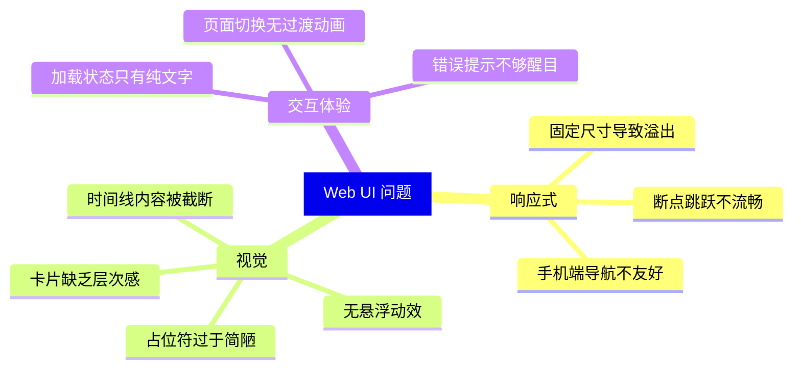
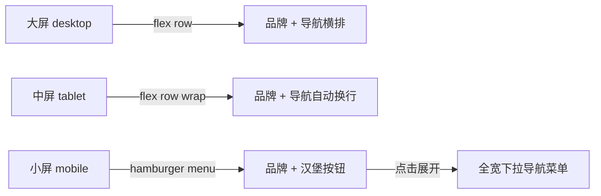

# Web UI 优化方案

> **约束条件**：不修改任何后端代码（C++ / Python / SQL / config），仅修改 `web/` 目录下的前端文件。

---

## 一、问题总览

---

## 二、各阶段详细方案

### Phase 1：全局基础样式升级 — `style.css`

**目标**：建立响应式设计基础，引入流式字体和统一过渡。

| 改动项 | 当前问题 | 优化方案 |
|--------|---------|---------|
| 字体系统 | 固定 `rem/px` 值，断点间跳变明显 | 引入 `clamp()` 流式字体：`font-size: clamp(1rem, 2.5vw, 1.125rem)` |
| CSS 变量 | 仅有颜色和阴影变量 | 新增 `--radius-sm/md/lg`、`--space-xs/s/m/l/xl`、`--transition-fast/normal` |
| 全局过渡 | 无 | 为 `a`, `button`, `card` 添加统一 `transition: all 0.2s ease` |
| 滚动条 | 系统默认 | 添加自定义滚动条样式（webkit），更轻量 |

**文件**：`web/src/style.css`

---

### Phase 2：AppShell 响应式重设计

**目标**：顶部导航栏在各种屏幕下美观可用。

| 改动项 | 当前问题 | 优化方案 |
|--------|---------|---------|
| 顶栏布局 | 小屏 `flex-direction: column` 导航链接直接暴露 | 新增汉堡按钮 + 抽屉式下拉菜单，移动端默认收起 |
| 顶栏固定 | 不固定，滚动后消失 | 改为 `position: sticky; top: 0; z-index: 100` |
| 品牌区域 | 小屏品牌名可能溢出 | 添加 `overflow: hidden; text-overflow: ellipsis` |
| 导航链接 | 无悬浮效果 | 添加 hover 颜色渐变 + 下划线动画 |

**文件**：`web/src/shell/AppShell.vue`

---

### Phase 3：App.vue 状态交互优化

**目标**：加载、错误、空白状态更友好。

| 改动项 | 当前问题 | 优化方案 |
|--------|---------|---------|
| 加载状态 | 纯文字"加载中" | 添加 CSS 动画旋转加载指示器 |
| 错误状态 | 黄色边框卡片，信息密度低 | 改进为图标 + 标题 + 描述的结构化错误卡片 |
| 页面切换 | 直接替换，无过渡 | 使用 Vue `<Transition>` 组件添加淡入淡出 |

**文件**：`web/src/App.vue`

---

### Phase 4：ProductCatalogPage 英雄区

**目标**：首页英雄区在任何屏幕宽度下都保持美观比例。

| 改动项 | 当前问题 | 优化方案 |
|--------|---------|---------|
| 双栏网格 | `grid-template-columns: minmax(0, 0.95fr) minmax(20rem, 0.88fr)` 在中间尺寸溢出 | 使用 `clamp()` + 更合理的 `minmax` 断点 |
| 英雄文字 | `h1` 字号 2.75rem 在小屏突变为 2.1rem | 使用 `clamp(1.8rem, 5vw, 2.75rem)` 流式缩放 |
| 英雄区 padding | `3rem 2.8rem` 固定值，小屏浪费空间 | 使用 `clamp()` 流式间距 |
| cover-frame | 固定 `min-height: 15.5rem` / `8.7rem × 6.4rem` | 改为百分比 + `aspect-ratio` 自适应 |
| spotlight-card | `grid-template-columns: 0.9fr 1fr` 固定双栏 | 中屏改为单栏垂直布局 |

**文件**：`web/src/pages/ProductCatalogPage.vue`

---

### Phase 5：ProductCatalogPage 更新面板

**目标**：最近更新区域响应式更流畅。

| 改动项 | 当前问题 | 优化方案 |
|--------|---------|---------|
| 双栏布局 | `980px` 才变单栏，中间尺寸挤压 | 改为 `850px` 断点 + 流式 gap |
| 时间线 | `max-height: 15rem` 固定高度截断内容 | 去掉 `max-height`，改为自然高度 + 可选展开 |
| update-card | 固定 cover 尺寸 | 响应式 cover 尺寸 |

**文件**：`web/src/pages/ProductCatalogPage.vue`

---

### Phase 6：ProductCatalogPage 作品网格

**目标**：作品卡片网格更美观、更有交互感。

| 改动项 | 当前问题 | 优化方案 |
|--------|---------|---------|
| work-card | 无 hover 效果，静态感强 | 添加 `transform: translateY(-2px)` + shadow 加深 hover 效果 |
| work-card min-height | 固定 `18rem` 移动端太高 | 改为 `min-height: auto` 在小屏 |
| placeholder | 虚线边框 + 简单图标 | 添加渐变背景动画效果，更生动的占位状态 |
| 网格列数 | `minmax(min(100%, 15rem), 1fr)` 移动端可能单列过窄 | 微调最小宽度确保手机上不会太扁 |

**文件**：`web/src/pages/ProductCatalogPage.vue`

---

### Phase 7：ProductCatalogPage 方向区 + 页脚

**目标**：底部区域视觉统一。

| 改动项 | 当前问题 | 优化方案 |
|--------|---------|---------|
| direction-card | 无 hover 效果 | 添加 hover 边框高亮 |
| 页脚 | 简陋的分割线 + 文字 | 改进为更精致的页脚设计：深色背景、logo 回链、版权信息 |

**文件**：`web/src/pages/ProductCatalogPage.vue`

---

### Phase 8：Block 组件视觉优化（9个组件）

每个 block 统一添加：
- hover 过渡效果
- 卡片阴影层次
- 响应式间距

| 组件 | 主要改动 |
|------|---------|
| `HeroBlock.vue` | 流式标题字号 `clamp()`，按钮 hover 反色效果 |
| `FeatureGridBlock.vue` | 卡片 hover 上浮 + 阴影加深 |
| `RichTextBlock.vue` | 添加左侧装饰色条 |
| `ImageTextBlock.vue` | 图片 hover 轻微放大效果 |
| `ScreenshotGalleryBlock.vue` | 图片 hover overlay + 标题显示 |
| `DownloadPanelBlock.vue` | 下载按钮添加脉冲动画引导注意力 |
| `TimelineBlock.vue` | 数字标记添加渐变背景 |
| `FaqBlock.vue` | 问题行 hover 背景色变化 |
| `FooterCtaBlock.vue` | 按钮添加发光效果 |

**文件**：`web/src/blocks/*.vue`（全部 9 个）

---

### Phase 9：ReleaseDetailPage 工具栏优化

**目标**：版本详情页头部更清晰。

| 改动项 | 当前问题 | 优化方案 |
|--------|---------|---------|
| 工具栏网格 | 三栏 `grid-template-columns: auto minmax(0, 1fr) auto` 在中屏挤压 | 优化断点逻辑 |
| 返回按钮 | 无 hover 效果 | 添加 hover 背景色变化 |
| meta 信息 | 方框式排列，视觉重 | 改进为更轻量的标签样式 |

**文件**：`web/src/pages/ReleaseDetailPage.vue`

---

### Phase 10：最终验证

- 在 `320px / 375px / 768px / 1024px / 1440px / 1920px` 六个宽度下检查所有页面
- 确认无后端代码改动
- 确认 `vite build` 构建无报错

---

## 三、不涉及的改动

- ❌ 后端 C++ 代码（`src/`, `include/`）
- ❌ Python 管理脚本（`python/`）
- ❌ 数据库/迁移（`migrations/`）
- ❌ 配置文件（`config/`）
- ❌ API 接口定义（`web/src/runtime/api.ts`）— 保持原样
- ❌ 构建配置（`vite.config.ts`, `package.json`）— 不新增依赖

---

## 四、文件改动清单

| 文件路径 | 改动类型 |
|---------|---------|
| `web/src/style.css` | 重写 — 新增 CSS 变量、流式字体、全局过渡 |
| `web/src/shell/AppShell.vue` | 重写 `<style>` — 粘性顶栏 + 汉堡菜单 |
| `web/src/App.vue` | 修改 `<template>` + `<style>` — 加载动画、过渡 |
| `web/src/pages/ProductCatalogPage.vue` | 重写 `<style>` — 全面响应式优化 |
| `web/src/pages/ReleaseDetailPage.vue` | 修改 `<style>` — 工具栏视觉优化 |
| `web/src/blocks/HeroBlock.vue` | 修改 `<style>` |
| `web/src/blocks/FeatureGridBlock.vue` | 修改 `<style>` |
| `web/src/blocks/RichTextBlock.vue` | 修改 `<style>` |
| `web/src/blocks/ImageTextBlock.vue` | 修改 `<style>` |
| `web/src/blocks/ScreenshotGalleryBlock.vue` | 修改 `<style>` |
| `web/src/blocks/DownloadPanelBlock.vue` | 修改 `<style>` |
| `web/src/blocks/TimelineBlock.vue` | 修改 `<style>` |
| `web/src/blocks/FaqBlock.vue` | 修改 `<style>` |
| `web/src/blocks/FooterCtaBlock.vue` | 修改 `<style>` |
| `web/src/runtime/BlockRenderer.vue` | 修改 `<style>` — 区块间距优化 |

**总计**：15 个文件，全部为纯前端 `.vue` / `.css` 文件，零后端影响。

---

## 五、技术策略

1. **不引入新依赖** — 纯 CSS 优化，利用 Vue 3 内置 `<Transition>` 组件
2. **使用 CSS `clamp()` 实现流式排版** — 消除断点跳跃
3. **渐进增强** — 大屏体验更好，小屏保证可用
4. **CSS 变量统一管理** — 设计 token 集中在 `style.css`
